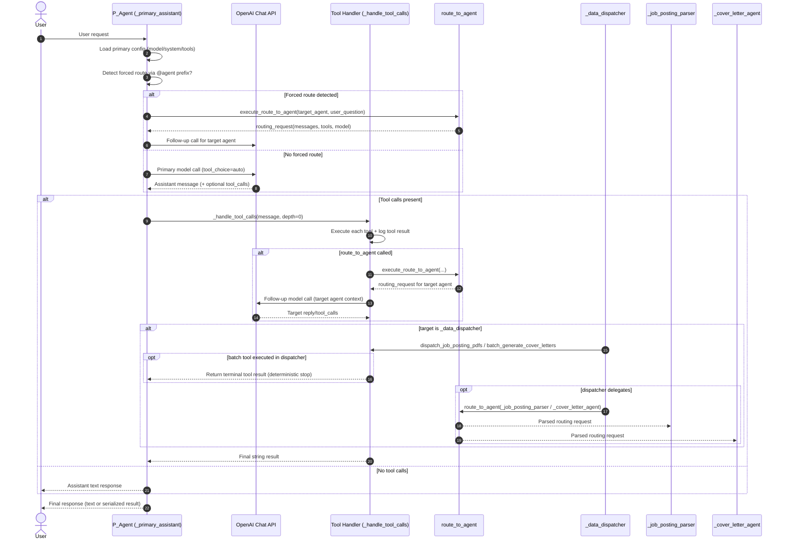
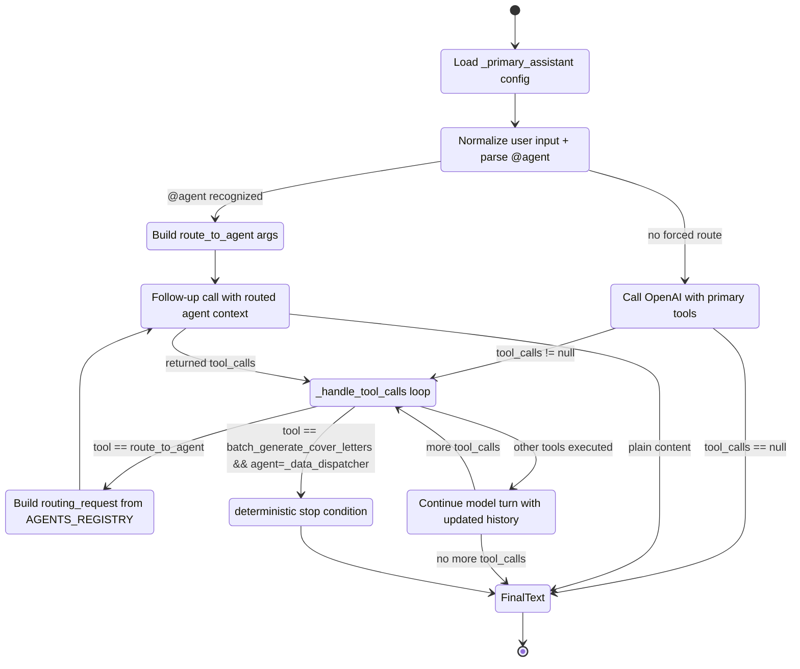

# Agent Configuration Diagrams (Current State)

Source of truth used:
- `alde/agents_registry.py`
- `alde/chat_completion.py`
- `alde/agents_factory.py`
- `alde/tools.py`

## 1) Sequence Diagram (Primary Agent initializes workflow + autonomous decision)

## 2) State Diagram (Primary agent lifecycle + autonomous routing)

## Notes about current configuration

- Registered agents:
  - `_primary_assistant`
  - `_data_dispatcher`
  - `_job_posting_parser`
  - `_cover_letter_agent`
- `route_to_agent` is the central handoff primitive.
- Tool group `@dispatcher` expands to:
  - `dispatch_job_posting_pdfs`
  - `batch_generate_cover_letters`
  - `vdb_worker`
- Deterministic stop exists for dispatcher batch runs after `batch_generate_cover_letters`.
- Current `ChatCom.get_response()` passes `agent_label="_data_dispatcher"` when handling tool calls, which influences follow-up tool context.
