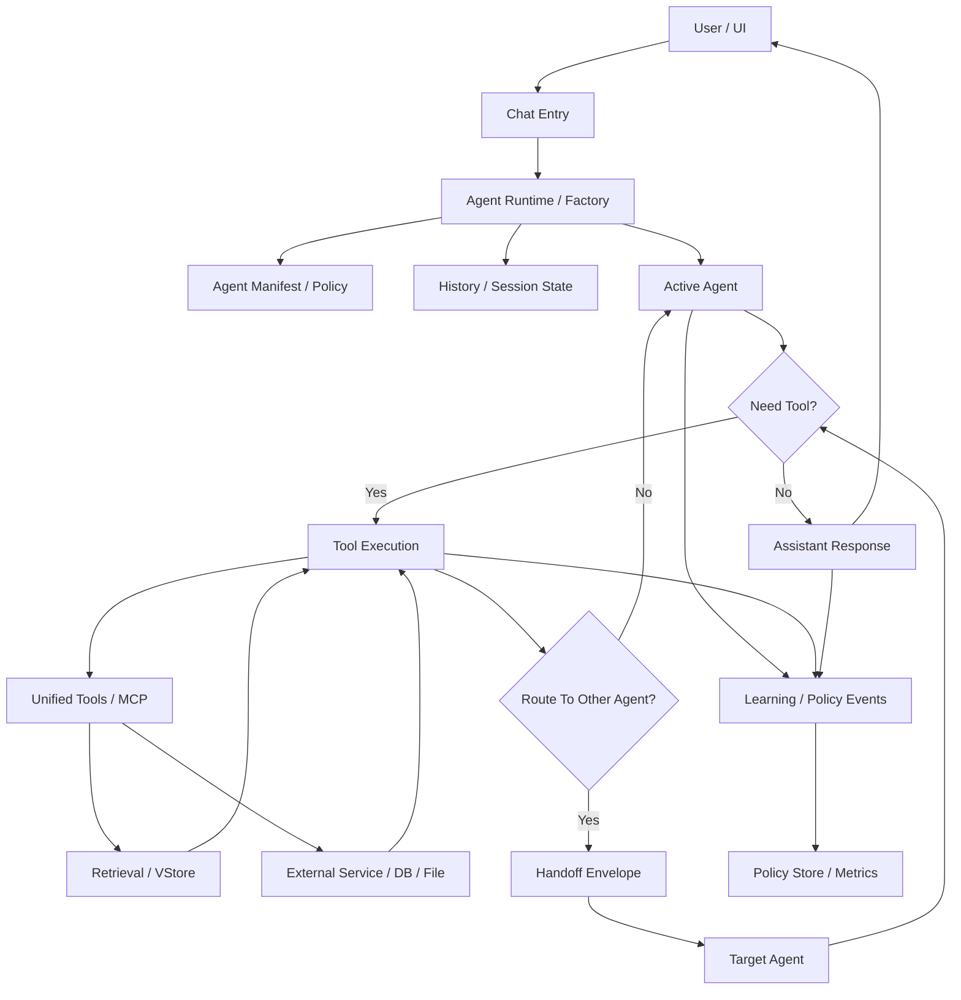

# Request Response And Handoff Flow

This document captures the intended request, tool, and handoff flow for ALDE in a renderer-safe form.

## Mermaid Diagram



## ASCII Fallback

```text
User / UI
  |
  v
Chat Entry
  |
  v
Agent Runtime / Factory
  |----------------------> Agent Manifest / Policy
  |----------------------> History / Session State
  |
  v
Active Agent
  |
  v
Need Tool?
  |
  |-- No --> Assistant Response --> User
  |
  |-- Yes --> Tool Execution
              |
              v
           Unified Tools / MCP
              |
              |----> Retrieval / VStore
              |
              |----> External Service / DB / File
              |
              v
           Tool Result
              |
              v
           Route To Other Agent?
              |
              |-- No --> back to Active Agent
              |
              |-- Yes --> Handoff Envelope --> Target Agent --> next decision

Parallel event stream:

Active Agent --------\
Tool Execution ------- > Learning / Policy Events --> Policy Store / Metrics
Final Response ------/
```

## Operational Reading

1. A request enters through UI or chat entry.
2. Runtime loads agent manifest and session state.
3. The active agent decides whether to answer directly or use a tool.
4. Tool execution flows through unified tools or MCP.
5. Retrieval and external service access are capability-plane concerns, not UI concerns.
6. Handoffs create a structured boundary before another agent continues execution.
7. Events are emitted in parallel for observability, evaluation, and future adaptive policy.