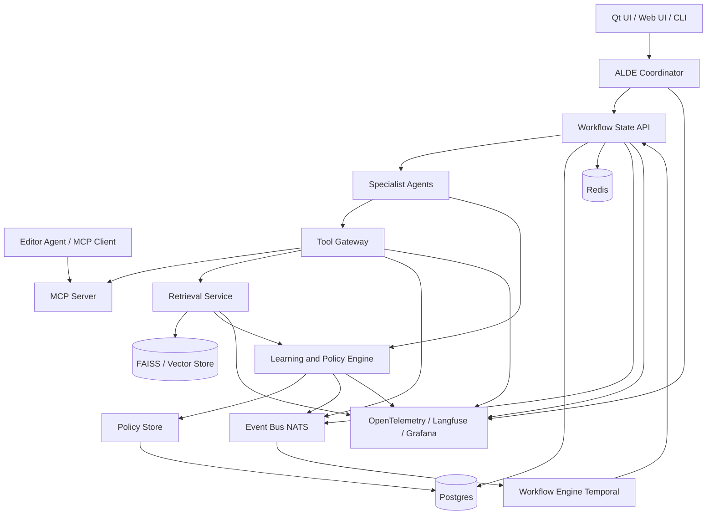

# ALDE Architecture Flowchart

```mermaid
flowchart TB
    UI[Qt UI / Web UI / CLI]
    MCPClient[Editor Agent / MCP Client]
    Coordinator[ALDE Coordinator]
    WorkflowAPI[Workflow State API]
    Specialists[Specialist Agents]
    ToolGateway[Tool Gateway]
    MCPServer[MCP Server]
    Retrieval[Retrieval Service]
    Learning[Learning and Policy Engine]
    PolicyStore[Policy Store]
    EventBus[Event Bus NATS]
    Temporal[Workflow Engine Temporal]
    Postgres[(Postgres)]
    Redis[(Redis)]
    VectorStore[(FAISS / Vector Store)]
    Observability[OpenTelemetry / Langfuse / Grafana]

    UI --> Coordinator
    MCPClient --> MCPServer
    Coordinator --> WorkflowAPI
    WorkflowAPI --> Specialists
    Specialists --> ToolGateway
    ToolGateway --> MCPServer
    ToolGateway --> Retrieval
    Retrieval --> VectorStore

    Specialists --> Learning
    Retrieval --> Learning
    Learning --> PolicyStore
    PolicyStore --> Postgres

    WorkflowAPI --> Postgres
    WorkflowAPI --> Redis

    WorkflowAPI --> EventBus
    ToolGateway --> EventBus
    Learning --> EventBus

    Temporal --> WorkflowAPI
    EventBus --> Temporal

    Coordinator --> Observability
    WorkflowAPI --> Observability
    ToolGateway --> Observability
    Retrieval --> Observability
    Learning --> Observability
```